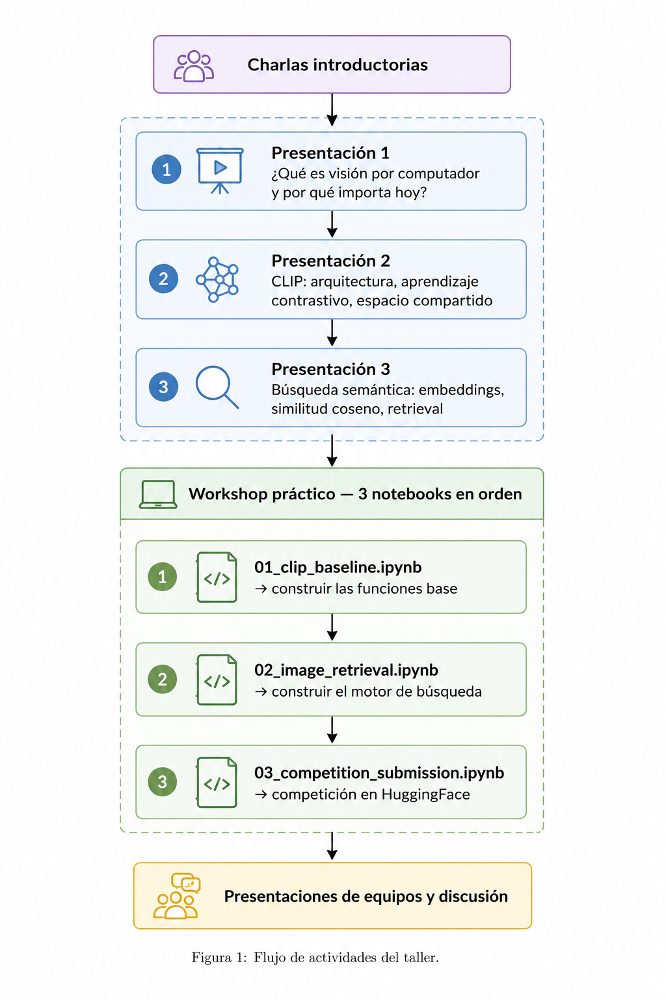

# Workshop: Búsqueda Semántica Multimodal con CLIP

**Universidad EAFIT**

---

## ¿Qué vamos a construir?

Un motor de búsqueda semántica que permite encontrar imágenes usando lenguaje natural — sin etiquetas, sin entrenamiento adicional. Al final del workshop, tendrás un sistema capaz de recibir una descripción como `"a cyclist jumping in the air"` y recuperar las imágenes más relevantes de un corpus de 2000 imágenes.

Esto es lo que hacen sistemas reales como Google Lens, Pinterest Visual Search o la búsqueda por imagen en e-commerce. La diferencia es que lo construirás desde cero, función por función.

---

## Flujo del workshop



---

## Lo que aprenderás

- Cómo CLIP proyecta imágenes y texto a un espacio vectorial compartido de 512 dimensiones
- Por qué la similitud coseno entre vectores normalizados es equivalente a un producto punto
- Cómo construir un índice vectorial de imágenes y hacer retrieval en milisegundos
- Cómo funciona la búsqueda imagen → imagen y por qué el pipeline es idéntico al de texto → imagen
- Qué tipos de queries fallan sistemáticamente en CLIP y por qué (negaciones, conteo, relaciones espaciales)
- Cómo combinar señales de texto e imagen en un sistema de búsqueda híbrida
- Qué es Reciprocal Rank Fusion y cuándo supera a la fusión lineal de scores

---

## Estructura de los notebooks

### `01_clip_baseline.ipynb` — Fundamentos

El punto de partida. Se trabaja con 50 imágenes de Flickr30k para explorar los conceptos sin tiempos de espera.

| TODO | Función | Qué hace |
|------|---------|----------|
| 1 | `get_text_embeddings` | Tokeniza textos y extrae embeddings normalizados L2 |
| 2 | `get_image_embeddings` | Preprocesa imágenes PIL y extrae embeddings normalizados L2 |
| 3 | `compute_similarity_matrix` | Calcula la matriz N×N de similitud coseno entre imágenes y textos |
| 4 | `compute_scores` | Calcula el vector de scores de un query contra todo el corpus |

Al terminar este notebook se puede visualizar la matriz de similitud y ver que los pares correctos tienen scores más altos que los aleatorios — eso es la evidencia de que el espacio compartido de CLIP funciona.

---

### `02_image_retrieval.ipynb` — Motor de búsqueda

Escala a 800 imágenes y construye el motor de búsqueda completo. Las 4 funciones del notebook 01 se copian en la celda de setup.

| TODO | Función | Qué hace |
|------|---------|----------|
| 5 | `build_image_index` | Indexa el corpus en batches de 32, retorna matriz `(800, 512)` |
| 6 | `search_by_text` | Pipeline completo texto → top-k imágenes |
| 7 | `search_by_image` | Pipeline imagen → top-k imágenes similares (mismo código, distinto encoder) |

Incluye dos widgets interactivos: uno para escribir queries de texto y ver los resultados en tiempo real, y uno con slider para elegir una imagen del corpus como query.

Al final, una sección de **casos de fallo** donde se prueba CLIP con negaciones, conteo exacto y relaciones espaciales — y una tabla de reflexión para completar.

---

### `03_competition_submission.ipynb` — Reto final

El reto de la competición. Corpus de 2000 imágenes. Se dan **3 imágenes de referencia fijas** para todos los equipos:

- `ref_0` — partido de fútbol
- `ref_1` — ciclista BMX en el aire  
- `ref_2` — gente bailando en club nocturno

| TODO | Qué implementar |
|------|----------------|
| **A** | Definir un query de texto para cada imagen de referencia. No se pueden usar captions del dataset — hay que inventarlos. |
| **B** | `search_by_reference`: fusión lineal de scores de texto e imagen `score = α · sim_texto + (1-α) · sim_imagen` |
| **C (extra)** | Mejora libre: query ensemble, Reciprocal Rank Fusion, o alpha distinto por referencia |

**Métrica — Overlap@10:** los top-10 de cada equipo se comparan contra los top-10 que recuperaría un oracle que conoce los captions reales de Flickr30k. Cuanto mejor describes la imagen con tu query, mayor el overlap.

$$\text{score} = \frac{1}{3} \sum_{i=1}^{3} \frac{|\text{top-10}_{\text{tuyo}}(i) \cap \text{top-10}_{\text{oracle}}(i)|}{10}$$

Los equipos con el mismo método pero distinto query obtendrán resultados distintos — eso es lo que diferencia el leaderboard.

---

## Recursos de referencia

Dos hojas de referencia rápida disponibles en el repositorio para consultar mientras se trabaja en los TODOs:

- `ref_01_pytorch_hf_models.md` — cómo usar modelos de HuggingFace: `from_pretrained`, `eval()`, `no_grad()`, mover tensores al device, extraer features
- `ref_02_tensor_operations.md` — operaciones de tensor necesarias: shapes, producto matricial, normalización L2, `topk`, `argsort`, `cat`, fusión lineal

---

## Setup técnico

Todo corre en **Google Colab con CPU**. No se necesita GPU ni cuenta de pago.

```
# Notebooks 01 y 02
transformers, datasets (AnyModal/flickr30k), Pillow, ipywidgets, pandas, scikit-learn

# Notebook 03
transformers, datasets (Mozilla/flickr30k-transformed-captions), Pillow, pandas
```

Tiempos estimados de ejecución:
- Notebook 01: ~3 min (50 imágenes, sin indexación)
- Notebook 02: ~7 min total (~2 min de indexación + exploración)
- Notebook 03: ~10 min total (~5 min de indexación de 2000 imágenes + reto)

---

## Competición

La competición está en HuggingFace Competitions. El link se comparte al inicio del workshop.

- Límite: **3 submissions por día**
- Métrica: **Overlap@10** promedio sobre las 3 imágenes de referencia
- El notebook 03 incluye una función `evaluate_local` para medir el score localmente antes de subir
- El CSV de submission incluye el `query_text` usado — esto permite comparar estrategias en la discusión final

**Puntos de referencia esperados** para `clip-vit-base-patch32` con 2000 imágenes:

| Sistema | Overlap@10 aprox. |
|---------|-------------------|
| Texto puro con query genérico | ~0.10 |
| Texto puro con query descriptivo | ~0.20 |
| Híbrido bien tunado | ~0.25 |
| Híbrido + query ensemble (TODO C) | ~0.30 |

---

## Preguntas para la discusión final

- ¿Qué estrategia usaron para escribir los queries? ¿Qué aspectos de la imagen priorizaron?
- ¿El parámetro `alpha` óptimo fue el mismo para las 3 imágenes de referencia?
- ¿Por qué CLIP falla con negaciones? ¿Qué implicaciones tiene para aplicaciones reales?
- ¿En qué se diferencia un sistema de retrieval con CLIP de uno con FAISS + embeddings más grandes?
- ¿Cómo evolucionaría este sistema hacia un RAG multimodal?
