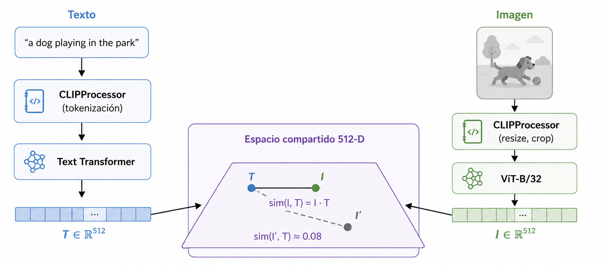

# Notebooks

Este directorio contiene los tres notebooks del workshop, diseñados para completarse en orden. Cada uno construye sobre el anterior — las funciones implementadas en el notebook 01 se copian y reutilizan en los siguientes.

---

## Orden de ejecución

---

## 01 — CLIP Baseline

**Objetivo:** implementar las cuatro funciones base que hacen posible la búsqueda semántica con CLIP.

Se trabaja con un subset de **50 imágenes** de Flickr30k para explorar los conceptos sin tiempos de espera. El foco es entender qué ocurre matemáticamente: cómo un texto y una imagen llegan a ser vectores comparables en el mismo espacio.

| TODO | Función | Qué implementar |
|------|---------|----------------|
| 1 | `get_text_embeddings` | Tokenizar textos con `CLIPProcessor` y extraer embeddings normalizados L2 con `model.get_text_features` |
| 2 | `get_image_embeddings` | Preprocesar imágenes PIL y extraer embeddings normalizados L2 con `model.get_image_features` |
| 3 | `compute_similarity_matrix` | Calcular la matriz N×N de similitud coseno entre imágenes y textos como producto matricial |
| 4 | `compute_scores` | Calcular el vector de scores (N,) de un único query contra todo el corpus |

**Visualizaciones incluidas:**
- Matriz de similitud 15×15 como heatmap — la diagonal más brillante confirma que CLIP alinea los pares correctos
- Distribución de scores para un query de texto con top-3 imágenes mostradas
- Búsqueda imagen → imagen con la imagen query y sus 3 más similares

Al terminar este notebook, correr la **celda de test integral** al final que verifica que las cuatro funciones tienen los shapes y normalización correctos.

---

## 02 — Image Retrieval

**Objetivo:** construir el motor de búsqueda completo sobre un corpus de **800 imágenes**.

Las cuatro funciones del notebook 01 se copian en la celda de setup. El notebook escala el pipeline y añade la capacidad de buscar con una imagen como query.

| TODO | Función | Qué implementar |
|------|---------|----------------|
| 5 | `build_image_index` | Procesar el corpus en batches de 32 y concatenar los embeddings en una matriz `(800, 512)` |
| 6 | `search_by_text` | Pipeline completo: texto → embedding → scores → top-k índices y scores |
| 7 | `search_by_image` | Pipeline imagen → embedding → scores → top-k, con soporte para excluir la imagen query del resultado |

**Visualizaciones incluidas:**
- Histograma de similitudes: pares correctos vs pares aleatorios — evidencia de que el espacio compartido funciona
- Heatmap 30×30 de la matriz de similitud con la diagonal resaltada
- Widget interactivo de búsqueda por texto con selector de top-k
- Widget interactivo de búsqueda por imagen con slider para elegir la imagen query

**Sección de casos de fallo:** cuatro queries diseñadas para fallar (negaciones, conteo, relaciones espaciales, atributos compuestos) con una tabla de reflexión para completar.

> ⚠️ La indexación de 800 imágenes tarda ~2 min en CPU. Ejecutar la celda de `build_image_index` una sola vez.

---

## 03 — Competition Submission

**Objetivo:** diseñar un sistema de búsqueda híbrida y competir en el leaderboard de HuggingFace.

Corpus de **2000 imágenes**. Se dan tres imágenes de referencia fijas — un partido de fútbol, un ciclista BMX y gente bailando en un club nocturno. Para cada una, el estudiante debe inventar un query de texto descriptivo y construir un sistema que combine esa señal de texto con la señal visual de la imagen de referencia.

| TODO | Qué implementar |
|------|----------------|
| **A** | Definir `my_queries`: un query de texto en inglés para cada imagen de referencia. No se pueden usar captions del dataset. Mínimo 10 caracteres por query. |
| **B** | `search_by_reference`: fusión lineal `score = α · sim_texto + (1−α) · sim_imagen`. El parámetro `alpha` controla el balance entre modalidades. |
| **C** *(extra)* | Mejorar el sistema: query ensemble (promediar múltiples queries), Reciprocal Rank Fusion, o alpha distinto por imagen de referencia. |

**Métrica — Overlap@10:**

$$\text{score} = \frac{1}{3} \sum_{i=1}^{3} \frac{|\text{top-10}_{\text{tuyo}}(i) \cap \text{top-10}_{\text{oracle}}(i)|}{10}$$

Los top-10 del estudiante se comparan contra los top-10 que recuperaría un oracle que conoce los captions reales de Flickr30k. Equipos con el mismo método pero distinto query obtendrán resultados distintos — eso es lo que genera variación en el leaderboard.

**Flujo de trabajo recomendado:**
1. Implementar TODO A y TODO B
2. Usar `evaluate_local` para medir Overlap@10 con distintos valores de `alpha`
3. Elegir el `alpha` óptimo antes de gastar un submit
4. Generar `submission.csv` con `generate_submission`
5. Descargar y subir al leaderboard de HuggingFace

> ⚠️ Límite de **3 submissions por día**. Explorar alphas localmente antes de subir.  
> ⚠️ La indexación de 2000 imágenes tarda ~5 min en CPU. Ejecutar `build_image_index` una sola vez.

---

## Dataset

Los tres notebooks usan **Flickr30k**, un dataset estándar de image-text retrieval con ~31K imágenes y 5 captions por imagen.

| Notebook | Dataset | Split | Tamaño |
|----------|---------|-------|--------|
| 01 | `AnyModal/flickr30k` | test | 50 imágenes (muestra) |
| 02 | `AnyModal/flickr30k` | test | 800 imágenes |
| 03 | `Mozilla/flickr30k-transformed-captions` | test | 2000 imágenes |

Todos usan `SEED = 42` para reproducibilidad — el corpus es el mismo en todas las sesiones.

---

## Referencias

- `../references/ref_01_pytorch_hf_models.md` — cómo usar modelos de HuggingFace: `from_pretrained`, `eval()`, `no_grad()`, mover tensores al device
- `../references/ref_02_tensor_operations.md` — operaciones de tensor: shapes, producto matricial, normalización L2, `topk`, `argsort`, `cat`
